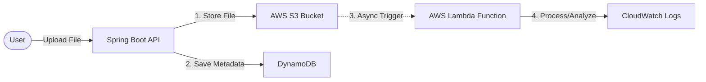

# S3entinel
> A Secure, Event-Driven File Ingestion System built with Spring Boot and AWS Serverless.

## How this system Works (Event-Driven Flow):
>1. **Ingest:** The user uploads a file via the Spring Boot API.

>2. **Storage:** The API streams the file securely to AWS S3 (The Warehouse).

>3. **Memory:** Metadata (Size, Type, Time) is instantly indexed in DynamoDB (The Memory).

>4. **Reaction:** S3 automatically emits an event notification.

>5. **Processing:** AWS Lambda wakes up, catches the event, and performs background analysis (e.g., Image Resizing, Virus Scanning) without blocking the user.

## How to Run 

You can run this project directly inside **IntelliJ IDEA**.

### Run in IntelliJ IDEA
This is the fastest way to verify the code works without configuring AWS keys or databases.

1.  Open the project in **IntelliJ IDEA**.
2.  Navigate to `src/test/java/com/codebymathabo/s3entinel/FileServiceImplTest.java`.
3.  Right-click the file and select **Run 'FileServiceImplTest'**.
4.  You will see green checkmarks confirming the upload logic, file validation, and database mapping are working correctly.

## Architecture: The Hybrid Cloud
S3entinel demonstrates a **Hybrid Architecture**, combining a robust Enterprise API (Spring Boot) with modern Event-Driven Serverless tools (AWS Lambda).

