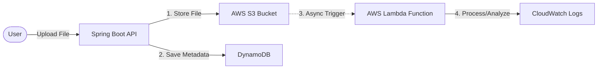

# S3entinel
A secure tool that automatically receives and processes files the moment they are uploaded, built using Spring Boot and AWS.

## Architecture: The Hybrid Cloud
For S3entinel, I wanted to see how different technologies work together, therefore it is built in two parts: a standard Spring Boot API to handle regular requests, and AWS Lambda to process background tasks automatically.

## How this tool Works (Event-Driven Flow):
>1. **Ingest:** The user uploads a file via the Spring Boot API.

>2. **Storage:** The API streams the file securely to AWS S3 (The Warehouse).

>3. **Memory:** Metadata (Size, Type, Time) is instantly indexed in DynamoDB (The Memory).

>4. **Reaction:** S3 automatically emits an event notification.

>5. **Processing:** AWS Lambda wakes up, catches the event, and performs background analysis such as Image Resizing, Virus Scanning without blocking the user.

## Design Diagram:

```mermaid
graph LR
    User([User]) -->|Upload File| API[Spring Boot API]
    API -->|1. Store File| S3[AWS S3 Bucket]
    API -->|2. Save Metadata| DDB[DynamoDB]
    S3 -.->|3. Async Trigger| Lambda[AWS Lambda Function]
    Lambda -->|4. Process/Analyze| Logs[CloudWatch Logs]
```
